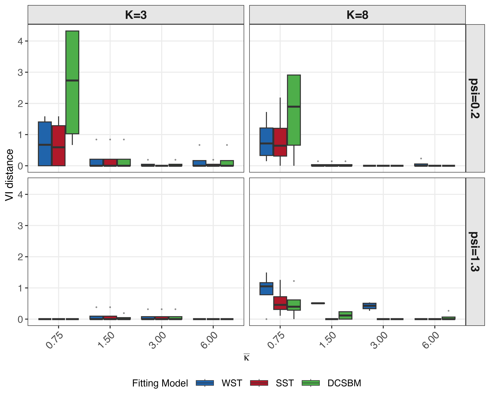
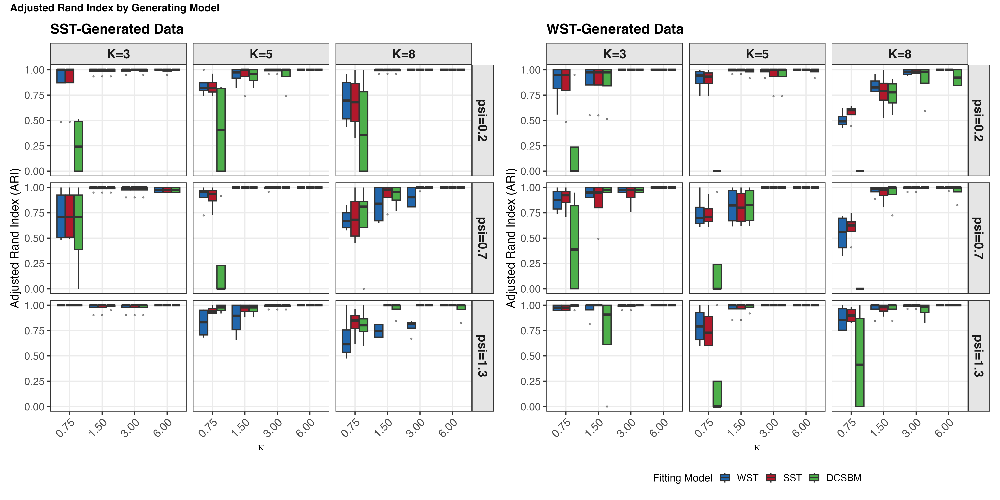

# Ordered Stochastic Block Models via Pólya--Gamma data augmentation

## Table of Contents

- [Overview](#overview)
- [Requirements](#requirements)
- [Bundle Contents](#bundle-contents)
- [Entry Scripts](#entry-scripts)
- [Regenerating Figures from Cached Results](#regenerating-figures-from-cached-results)
- [Regenerating the Manuscript Tables](#regenerating-the-manuscript-tables)
- [Full Reruns](#full-reruns)
- [Manuscript Preview](#manuscript-preview)
- [Label Update Note](#label-update-note)

## Overview

This directory is a self-contained reproduction bundle for the figures, tables,
cached numerical results, and derived summaries used by *Ordered Stochastic
Block Models via Pólya--Gamma data augmentation* (`ArXiv Submission.tex`).

Run commands from this directory:

```sh
cd "tex file/Ordered Stochastic Block Model"
```

The bundle includes cached MCMC results, post-processing outputs, CSV
summaries, data files, and regenerated plots. This allows the bundled figures
and tables to be checked or rebuilt without rerunning the most expensive MCMC
steps; full rerun entry points are also included.

## Requirements

Use R with the packages used by the project scripts, in particular:

```r
install.packages(c(
  "ggplot2", "dplyr", "tidyr", "readr", "patchwork", "viridis",
  "igraph", "ggraph", "graphlayouts", "mcclust", "mcclust.ext",
  "salso", "loo", "coda", "truncnorm", "fossil", "Matrix",
  "BayesLogit", "Rcpp", "lpSolve", "scales", "fs"
))
```

Some scripts run without optional packages by using fallbacks, but the list above
matches the environment used to create the bundled results.

## Bundle Contents

- `data/`: all empirical network data used by the application analysis.
- `core/`, `helper_folder/`: model fitting and helper functions.
- `scripts/`: renamed entry-point scripts plus copied helper script folders.
- `output/application/raw/application_run_20260529_110306/`: cached application MCMC fits and CSV summaries.
- `output/posterior_post_processing/application_run_20260529_110306/`: canonical posterior partitions, diagnostics, and K summaries used by plots.
- `output/simulation/raw/`: simulation result CSVs used for ARI/VI figures.
- `output/simulation/plots/2026-06-15_sst_labels/`: regenerated simulation plots with `SST` labels.
- `output/paper/figures/application_run_20260529_110306_sst_labels/`: regenerated application figures with `SST` labels.
- `paper_figures/all_figures/`: manuscript figure assets copied into the bundle; the preview index below shows how they map to the numbered environments in `ArXiv Submission.tex`.
- `paper_figures/updated plots/`: collected updated application and simulation plots used for the ArXiv submission build.

## Entry Scripts

- `scripts/01_run_application_mcmc.R`: full application MCMC run.
- `scripts/02_run_main_simulation_study.R`: full main simulation study.
- `scripts/03_build_application_postprocessing_cube.R`: builds canonical z-hat/K/diagnostic cube from application fits.
- `scripts/04_build_paper_tables.R`: rebuilds the application-side tabular outputs used by *Ordered Stochastic Block Models via Pólya--Gamma data augmentation* from cached application results.
- `scripts/05_plot_paper_application_figures.R`: rebuilds the application-network figures and Bradley--Terry additivity diagnostic used by the ArXiv submission.
- `scripts/06_plot_simulation_recovery_figures.R`: rebuilds the main-text and supplementary ARI/VI simulation figures.
- `scripts/07_plot_support_geometry.R`: rebuilds support-geometry diagnostics.
- `scripts/08_plot_mirrored_ocrp_diagnostics.R`: rebuilds mirrored OCRP prior diagnostics.
- `scripts/09_build_bradley_terry_delta_plot.R`: rebuilds the BT additivity diagnostic only.
- `scripts/10_plot_prior_satisfaction_rate.R`: archived diagnostic script for prior satisfaction checks.

The copied `scripts/analysis`, `scripts/application`, `scripts/simulation`,
`scripts/diagnostics`, and `scripts/testing` folders are dependencies for these
entry points.

## Regenerating Figures from Cached Results

### Application Network Figures

These commands regenerate the application figures used in *Ordered Stochastic
Block Models via Pólya--Gamma data augmentation* without refitting models. The
output folder name is intentionally separate from the cached manuscript copy.

```sh
APP_RUN_DIR=output/application/raw/application_run_20260529_110306 \
APP_PAPER_FIGURES_DIR=output/paper/figures/rebuilt_application_sst_labels \
APP_PAPER_TABLES_DIR=output/paper/tables/rebuilt_application_sst_labels \
Rscript scripts/05_plot_paper_application_figures.R
```

This reproduces the bighorn sheep tier-line comparison, the six application
block-flow panels, and the Bradley--Terry additivity diagnostic.

The ArXiv submission currently uses the copies in `paper_figures/all_figures/`;
the preview index below shows the corresponding entries in `ArXiv Submission.tex`.

### Simulation ARI/VI Figures

```sh
SIM_RESULTS_PATH=output/simulation/raw/full_simulation_crossfit_final_DemoKvar_run_20260302_153429.csv \
SIM_PLOTS_OUTPUT_DIR=output/simulation/plots/rebuilt_sst_labels \
Rscript scripts/06_plot_simulation_recovery_figures.R
```

This reproduces Figure 4 (`fig:vi-boxplot-wst`) together with the supplementary
recovery figures `fig:vi-SST-gen` and `fig:ari-combined`, plus the summary CSVs
used to build them.

### Support Geometry Figure

```sh
Rscript scripts/07_plot_support_geometry.R
```

This rebuilds Figure 2 (`fig:psi-geometries`), cached in
`paper_figures/all_figures/` and `output/diagnostics/support_geometry/`.

### Mirrored OCRP Diagnostic Figures

```sh
Rscript scripts/08_plot_mirrored_ocrp_diagnostics.R
```

This rebuilds the OCRP prior figures under `output/simulation/ocrp_tests_mirrored/`,
including the K prior, position profile, end-block, max-block, and equal-size
diagnostics used by the supplement.

## Regenerating the Manuscript Tables

<a id="reproduce-manuscript-tables"></a>
From cached application fits:

```sh
APP_RUN_DIR=output/application/raw/application_run_20260529_110306 \
Rscript scripts/04_build_paper_tables.R
```

This rebuilds the application-side tabular outputs read by the submission via
`\input{...}`: the model-comparison table (`tab:model-selection`), the
hierarchy and violation summaries, the Bradley--Terry delta summary, and the
application supplement tables, including `tab:application-cycle-diagnostics`,
under `output/paper/tables/application_run_20260529_110306/`.

<a id="reproduce-simulation-tables"></a>
For the simulation tables in the preview index, rerun the downstream simulation
analysis on the cached CSV:

```sh
SIM_RESULTS_PATH=output/simulation/raw/full_simulation_crossfit_final_DemoKvar_run_20260302_153429.csv \
Rscript scripts/analysis/analyze_simulation.R
```

This rewrites the main-text and appendix simulation tables under
`output/simulation/tables/`, including the Table 1 and Table 2 sources plus the
supplementary scenario summaries.

To rebuild only the Bradley-Terry additivity diagnostic:

```sh
APP_RUN_DIR=output/application/raw/application_run_20260529_110306 \
APP_PAPER_TABLES_DIR=output/paper/tables/rebuilt_bt_delta \
APP_PAPER_FIGURES_DIR=output/paper/figures/rebuilt_bt_delta \
Rscript scripts/09_build_bradley_terry_delta_plot.R
```

## Full Reruns

Full reruns are computationally expensive and may not reproduce byte-identical
MCMC output unless the same R version, package versions, and random-number
streams are used.

Application MCMC:

```sh
APP_N_ITER=10000 APP_BURN=3000 APP_THIN=2 APP_SEED=42 \
Rscript scripts/01_run_application_mcmc.R
```

Main simulation study:

```sh
Rscript scripts/02_run_main_simulation_study.R
```

After a full simulation rerun, refresh the downstream simulation figures and
tables with:

```sh
SIM_RESULTS_PATH=output/simulation/raw/<new_simulation_results_csv> \
Rscript scripts/analysis/analyze_simulation.R
```

After a full application rerun, use the new run directory in:

```sh
APP_RUN_DIR=output/application/raw/<new_application_run_id> \
Rscript scripts/03_build_application_postprocessing_cube.R
```

Then rerun the table and plot scripts above with the same `APP_RUN_DIR`.

## Manuscript Preview

The numbering below follows the active figure and table environments in `ArXiv Submission.tex`. Figures 1 and 3 are drawn directly in TeX, so their preview cells are textual rather than image thumbnails. The application-side tables in this index are regenerated from cached fits via [this paragraph](#reproduce-manuscript-tables); the simulation tables are refreshed via [this paragraph](#reproduce-simulation-tables).

### Main Text

| No. | LaTeX label | Preview | Summary |
| --- | --- | --- | --- |
| Figure 1 | `fig:wst-sst-side-by-side` | TeX matrix sketch: WST uses a blue upper triangle, Toeplitz SST uses distance-colored upper triangle, and the lower triangle shows the reversed probabilities. | WST vs Toeplitz SST comparison. |
| Figure 2 | `fig:psi-geometries` |  | Support geometry in psi-space for WST, SST, Toeplitz SST, and LST. |
| Figure 3 | `fig:dag-osbm-generative` | TeX DAG + algorithm: hyperparameters feed kappa, psi, eta, and z; these generate Poisson counts N and observed edges A. | OSBM generative process. |
| Table 1 | `tab:sim-main-two-scenarios` | Sparse weak: Khat = 5.75/5.25/3.50, VI = 1.57/1.61/2.15 (SST-generated) and 1.70/1.64/2.25 (WST-generated).<br>Dense strong: Khat = 8.00/8.00/7.50, VI = 0.00/0.00/0.12 and 0.00/0.00/0.06. | Two representative K* = 8 simulation scenarios. |
| Table 2 | `tab:sim-main-two-scenarios-loo` | Sparse weak: best LOOIC is 5425 for SST-generated and 5348 for WST-generated.<br>Dense strong: best LOOIC is 13083 for SST-generated and 12103 for WST-generated. | Compact predictive comparison for the same scenarios. |
| Figure 4 | `fig:vi-boxplot-wst` |   | VI recovery boxplots for WST-generated and SST-generated data. |
| Table 3 | `tab:datasets` | Dominance, citation, and friendship edge meanings across six datasets; n = 28, 35, 45, 47, 62, 70. | Directed weighted application networks and their edge meanings. |
| Figure 5 | `fig:tier_line_plot` |   | Bighorn sheep partition point estimates under SST and DC-SBM. |
| Table 4 | `tab:model-selection` | Winners by dataset: SST on sheep, goats, and high school; WST on hyenas; DC-SBM on journals and macaques. | Posterior model-comparison summary. |
| Figure 6 | `fig:block-flow-animal` |  | Empirical forward share for the spotted hyenas network. |
| Figure 7 | `fig:block-flow-human` |  | Empirical forward share matrices for the high-school dataset. |

### Supplement

| No. | LaTeX label | Preview | Summary |
| --- | --- | --- | --- |
| Table 5 | `tab:sim_dcsbm_gnedin_summary` | K_true = 3, 5, 7 -> mean ARI = 1 and mean Khat = 3, 5, 7. | DC-SBM sampler sanity check. |
| Figure 8 | `fig:vi-SST-gen` |  | SST-generated VI recovery across density and hierarchy settings. |
| Figure 9 | `fig:ari-combined` |  | Adjusted Rand Index recovery for SST and WST scenarios. |
| Table 6 | `tab:sim-mcmc-convergence` | Median interval width: WST 0.002, SST 0.004, DC < 0.001; most runs are below 0.05. | Violation-rate convergence diagnostic. |
| Table 7 | `tab:supp-small-sim-sensitivity` | Simulated SST is most stable under the default prior; sheep backward-flow and inferred block count shift as the prior tightens. | Prior sensitivity check. |
| Table 8 | `tab:sim-misspec` | WST and SST collapse to Khat = 2 and NVI = 0.33; DC-SBM recovers Khat = 5 and NVI = 0, with LOOIC about 11,867 vs about 13,000. | Misspecified non-hierarchical simulation. |
| Table 9 | `tab:application-cycle-diagnostics` | Cycle diagnostics across sheep, hyenas, goats, journals, macaques, and high school; the ordered fits are mostly acyclic, while DC-SBM shows more cycles. | Application point-estimate cycle diagnostics. |

## Label Update Note

The application and simulation plot scripts in this bundle use `SST` in figure
labels after the geometric section of the ArXiv submission. The old `Toeplitz
SST` labels are not used in the regenerated application plots.
