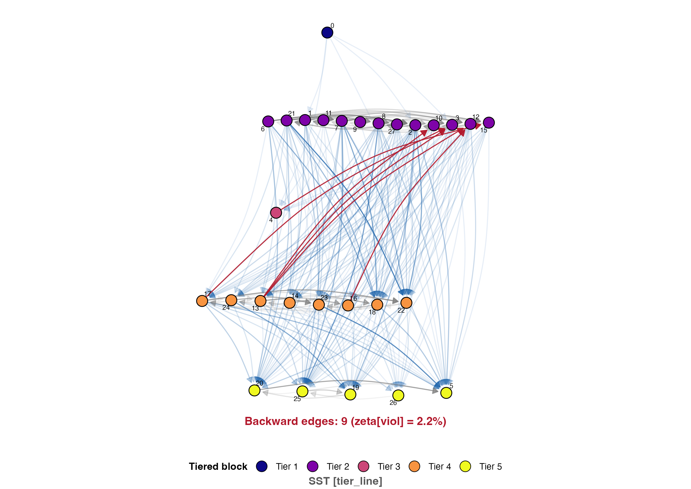
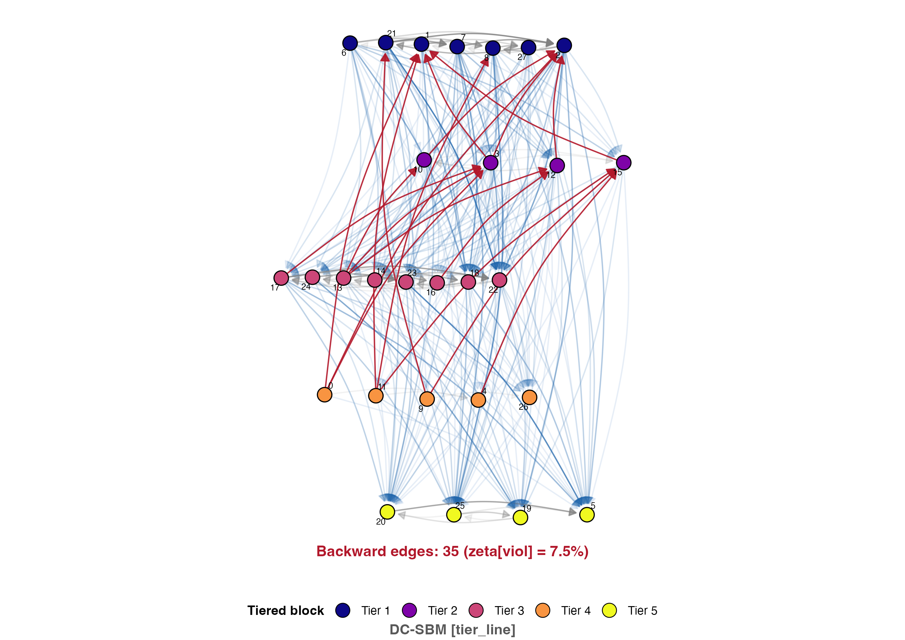
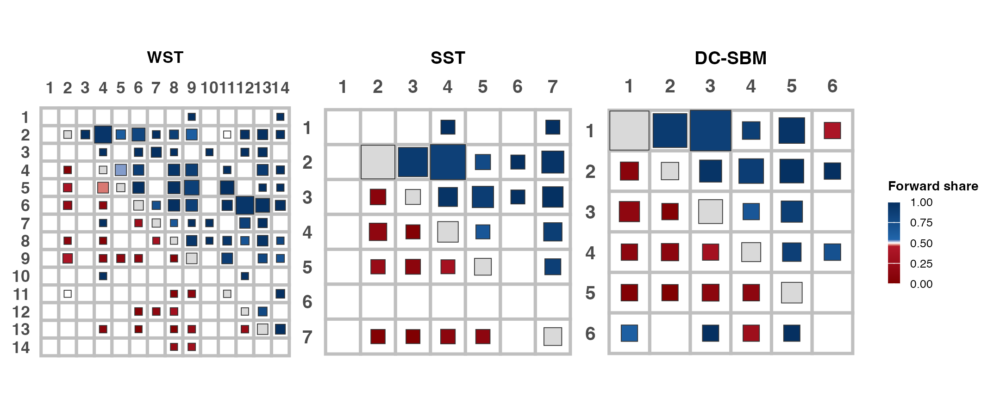

# Transitive SBM

Standalone reproduction bundle for the manuscript *Ordered Stochastic Block Models via Polya-Gamma data augmentation*.

This folder is the paper-facing miniature of the larger repository. The main repository itself stays unchanged, but this bundle should be read as the standalone `Transitive SBM` reproduction package.

## Before you start

Run commands from this folder:

```sh
cd "tex file/Ordered Stochastic Block Model"
```

Use R with the packages used by the bundle scripts, in particular:

```r
install.packages(c(
  "ggplot2", "dplyr", "tidyr", "readr", "patchwork", "viridis",
  "igraph", "ggraph", "graphlayouts", "mcclust", "mcclust.ext",
  "salso", "loo", "coda", "truncnorm", "fossil", "Matrix",
  "BayesLogit", "Rcpp", "lpSolve", "scales", "fs"
))
```

## At a glance

| Result in the PDF | Paper section | Preview | What it shows | Reproduce from this folder |
| --- | --- | --- | --- | --- |
| Figure 2 | Main text: support geometry |  | Support geometry in psi-space for WST, SST, Toeplitz SST, and LST. | `Rscript scripts/07_plot_support_geometry.R` |
| Table 1 | Main text: simulation study | Sparse weak and dense strong `K^*=8` scenarios, with `Khat`, VI, and recovery summaries. | The main simulation-recovery summary. | [Running the simulation study](#running-the-simulation-study) and [Analysing the simulation results](#analysing-the-simulation-results) |
| Table 2 | Main text: simulation study | Compact predictive comparison for the same scenarios as Table 1. | The main LOO-based simulation comparison. | [Running the simulation study](#running-the-simulation-study) and [Analysing the simulation results](#analysing-the-simulation-results) |
| Figure 4 | Main text: simulation study |   | VI recovery boxplots for WST-generated and SST-generated data. | [Analysing the simulation results](#analysing-the-simulation-results) |
| Table 3 | Main text: application datasets | Six bundled directed weighted networks: sheep, hyenas, goats, journals, macaques, and high school. | The data sources used in the application study. | See `data/` directly. |
| Table 4 | Main text: application study | Winners by dataset across WST, SST, and DC-SBM. | The main application model-comparison table. | [Running the application study](#running-the-application-study) and [Turning the application fits into paper outputs](#turning-the-application-fits-into-paper-outputs) |
| Figure 5 | Main text: application study |   | Bighorn sheep partition point estimates under SST and DC-SBM. | [Turning the application fits into paper outputs](#turning-the-application-fits-into-paper-outputs) |
| Figure 6 | Main text: application study |  | Empirical forward-share structure for the spotted hyenas network. | [Turning the application fits into paper outputs](#turning-the-application-fits-into-paper-outputs) |
| Figure 7 | Main text: application study |  | Empirical forward-share structure for the high-school network. | [Turning the application fits into paper outputs](#turning-the-application-fits-into-paper-outputs) |
| Table 9 | Supplement: application diagnostics | Cycle-diagnostic summary across the six application datasets. | The supplementary application cycle table. | [Turning the application fits into paper outputs](#turning-the-application-fits-into-paper-outputs) |

## Running the simulation study

If you want to generate a fresh simulation run rather than use the bundled cached CSV, run:

```sh
Rscript scripts/02_run_main_simulation_study.R
```

This calls the canonical fixed-`K` simulation driver `scripts/simulation/run_paper_main_simulation_grid.R` and saves the raw simulation fit outputs under:

- `output/simulation/raw/DemoKvar_runs/<run_id>/`

Inside that run directory, the main file is:

- `full_simulation_crossfit_final_<run_id>.csv`

The bundled paper results in this folder were analysed from:

- `output/simulation/raw/full_simulation_crossfit_final_DemoKvar_run_20260302_153429.csv`

That cached CSV is the file to use if you want to reproduce the paper outputs without rerunning the expensive simulation fits.

## Analysing the simulation results

To analyse the bundled simulation results and rebuild the paper-facing outputs, run:

```sh
Rscript scripts/06_build_simulation_tables_and_figures.R
```

To analyse a fresh simulation run instead, point `SIM_RESULTS_PATH` to the new CSV:

```sh
SIM_RESULTS_PATH=output/simulation/raw/DemoKvar_runs/<run_id>/full_simulation_crossfit_final_<run_id>.csv \
Rscript scripts/06_build_simulation_tables_and_figures.R
```

This analysis step writes:

- tables to `output/simulation/tables/`
- figures to `output/simulation/plots/`

For the main paper results:

- Table 1 is rebuilt as `output/simulation/tables/tab_sim_partition_main.tex`
- Table 2 is rebuilt as `output/simulation/tables/tab_sim_elpd_main.tex`
- Figure 4 is rebuilt as `output/simulation/plots/vi_boxplot_WST_gen.pdf` and `output/simulation/plots/vi_boxplot_SST_gen.pdf`

The same step also refreshes:

- `output/simulation/tables/sim_headline_compact.tex`
- `output/simulation/tables/sim_summary_partition.csv`
- `output/simulation/tables/sim_summary_order_block.csv`
- the companion ARI plots under `output/simulation/plots/`

## Running the application study

If you want to generate fresh application fits rather than use the bundled cached run, run:

```sh
APP_N_ITER=10000 APP_BURN=3000 APP_THIN=2 APP_SEED=42 \
Rscript scripts/01_run_application_mcmc.R
```

This calls the canonical application driver `scripts/application/run_application_model_fits.R` and saves a new fit directory under:

- `output/application/raw/application_run_<timestamp>/`

That directory contains the saved model fits and summaries, including:

- `*_fit.rds`
- `all_results.csv`
- `applications_results_summary_application_run_<timestamp>.csv`
- `model_comparison_loo.csv`
- `run_manifest.txt`

The bundled paper results in this folder use:

- `output/application/raw/application_run_20260529_110306/`

## Turning the application fits into paper outputs

The application pipeline has three stages.

First, build the canonical post-processing cube:

```sh
APP_RUN_DIR=output/application/raw/application_run_20260529_110306 \
Rscript scripts/03_build_application_postprocessing_cube.R
```

This writes:

- `output/posterior_post_processing/application_run_20260529_110306/`

That cube stores the canonical `z_hat`, `K_hat`, VI comparisons, and downstream diagnostics used by the plotting scripts.

Second, rebuild the paper tables:

```sh
APP_RUN_DIR=output/application/raw/application_run_20260529_110306 \
Rscript scripts/04_build_paper_tables.R
```

This writes:

- `output/paper/tables/application_run_20260529_110306/`

For the main paper results:

- Table 4 is rebuilt as `output/paper/tables/application_run_20260529_110306/model_selection_paper.tex`
- Table 9 is rebuilt as `output/paper/tables/application_run_20260529_110306/application_cycle_diagnostics.tex`

Third, rebuild the paper figures:

```sh
APP_RUN_DIR=output/application/raw/application_run_20260529_110306 \
APP_PAPER_FIGURES_DIR=output/paper/figures/rebuilt_application_sst_labels \
APP_PAPER_TABLES_DIR=output/paper/tables/rebuilt_application_sst_labels \
Rscript scripts/05_plot_paper_application_figures.R
```

This writes:

- figures to `output/paper/figures/rebuilt_application_sst_labels/`

In particular:

- Figure 5 uses the sheep tier-line files in that directory
- Figure 6 is rebuilt as `strauss_2019b_combined_block_networks_clean.pdf`
- Figure 7 is rebuilt as `high_school_combined_block_networks_clean.pdf`

## Where the bundled files came from

The paper-facing rebuild scripts and the raw-fit generators are different steps.

| Bundled artefact | What it is | Generated originally by | Consumed later by |
| --- | --- | --- | --- |
| `output/simulation/raw/full_simulation_crossfit_final_DemoKvar_run_20260302_153429.csv` | Cached simulation cross-fit results used for Table 1, Table 2, and Figure 4. | `scripts/simulation/run_paper_main_simulation_grid.R` (legacy alias: `scripts/simulation/DemoKvar.R`) | `scripts/06_build_simulation_tables_and_figures.R` |
| `output/application/raw/application_run_20260529_110306/` | Cached application MCMC fits and per-dataset summaries. | `scripts/application/run_application_model_fits.R` (legacy alias: `scripts/application/application_crp_ocrp.R`) | `scripts/03_build_application_postprocessing_cube.R`, `scripts/04_build_paper_tables.R`, `scripts/05_plot_paper_application_figures.R` |
| `output/posterior_post_processing/application_run_20260529_110306/` | Canonical post-processing cube with `z_hat`, `K_hat`, diagnostics, and VI comparisons. | `scripts/03_build_application_postprocessing_cube.R` / `scripts/analysis/build_post_processing.R` | `scripts/05_plot_paper_application_figures.R` and downstream application summaries |

In particular:

- `scripts/06_build_simulation_tables_and_figures.R` does not generate raw simulation fits; it analyses an existing simulation CSV.
- `scripts/04_build_paper_tables.R` and `scripts/05_plot_paper_application_figures.R` do not rerun application MCMC; they read an existing application fit directory.

## Which scripts are the public entry points

- `scripts/01_run_application_mcmc.R`
- `scripts/02_run_main_simulation_study.R`
- `scripts/03_build_application_postprocessing_cube.R`
- `scripts/04_build_paper_tables.R`
- `scripts/05_plot_paper_application_figures.R`
- `scripts/06_build_simulation_tables_and_figures.R`
- `scripts/07_plot_support_geometry.R`
- `scripts/08_plot_mirrored_ocrp_diagnostics.R`
- `scripts/09_build_bradley_terry_delta_plot.R`

The important renamed internal drivers are:

- `scripts/application/run_application_model_fits.R`
- `scripts/simulation/run_paper_main_simulation_grid.R`
- `scripts/simulation/run_random_k_ocrp_simulation_grid.R`
- `core/transitive_sbm_sampler.R`

Legacy aliases such as `DemoKvar.R`, `analyze_simulation.R`, and `my_best_try_so_far.R` are kept only for compatibility.

## What you can ignore for the arXiv reproduction

The following are bundled for context or extra diagnostics, but they are not part of the minimal paper reproduction path:

- `scripts/testing/`
- most of `scripts/diagnostics/`
- `scripts/simulation/misspec_*`
- `scripts/simulation/extended_sim_study*.R`
- `scripts/simulation/run_random_k_ocrp_simulation_grid.R`
