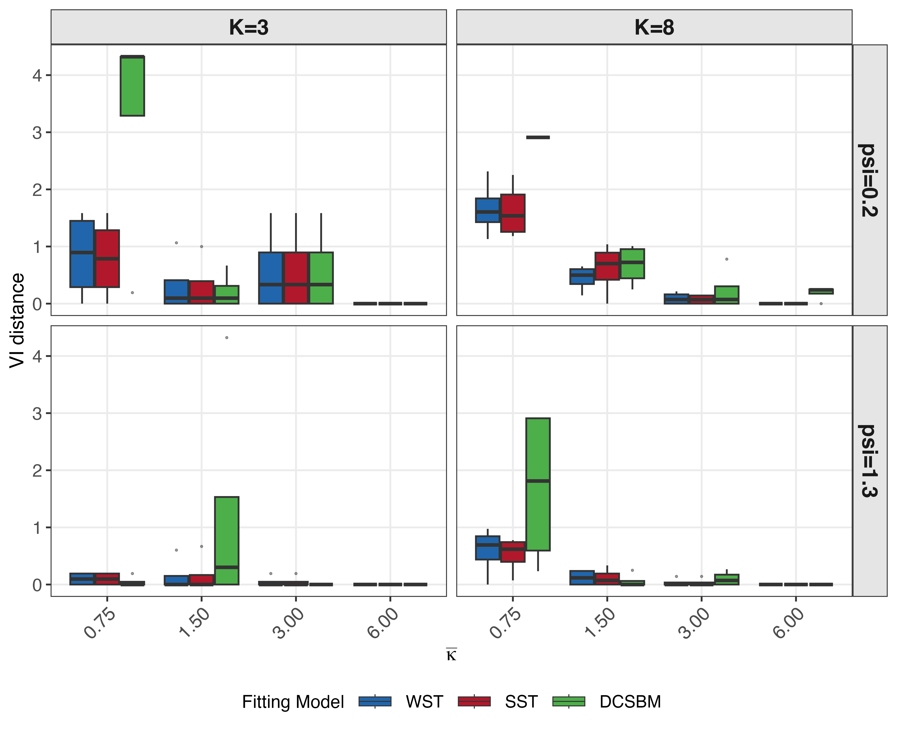
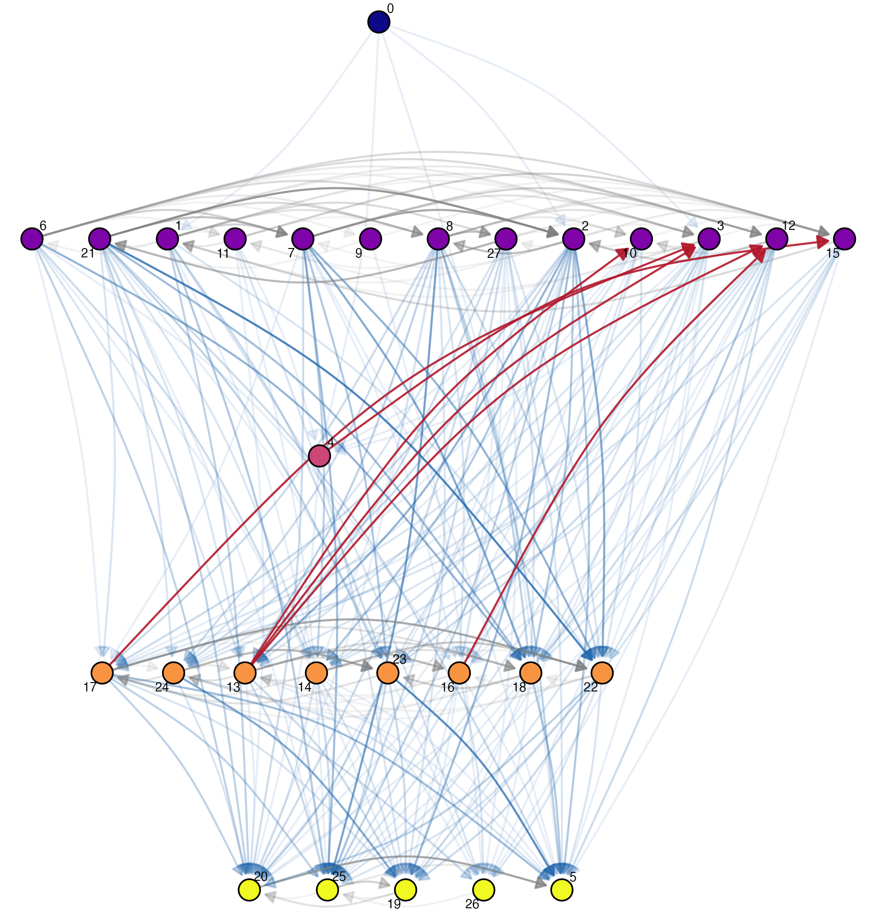
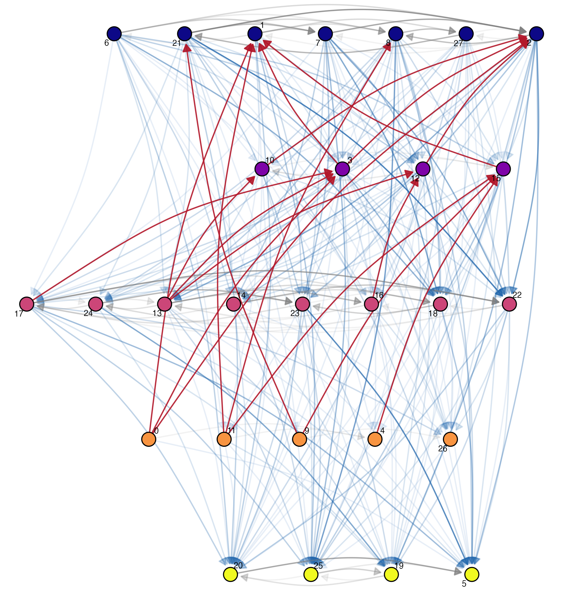
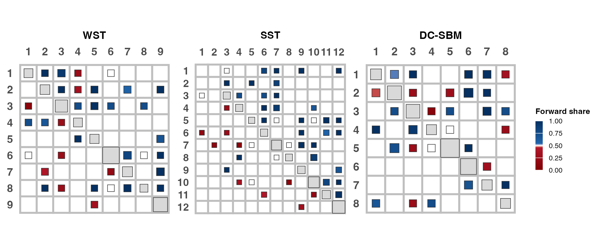
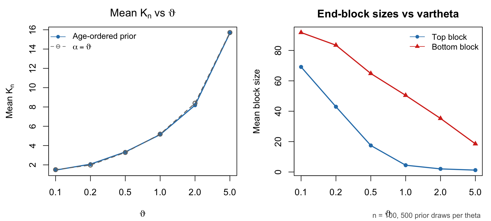

# Transitive SBM

Standalone reproduction bundle for the manuscript *Ordering Stochastic Block Models via prior transitivity*.

The repository contains:

- the MCMC samplers and helper code needed to reproduce the results of the paper;
- the six application datasets used in the paper;
- the scripts needed to regenerate simulations, application fits, tables, and figures

## Results presented in the paper and links to the key functions to reproduce them

| Result in the PDF | Paper section | Preview / description | Generated file(s) | Script entry point(s) | Key builder function(s) |
| --- | --- | --- | --- | --- | --- |
| Figure 2 | Main text: support geometry |  | `output/diagnostics/support_geometry/support_3d_shaded_geometry.png` | [`scripts/07_plot_support_geometry.R`](scripts/07_plot_support_geometry.R) | [`save_static_3d_shaded_geometry()`](scripts/07_plot_support_geometry.R) |
| Table 1 | Main text: simulation study | Sparse weak and dense strong scenarios with `K_hat`, exact-`K` recovery, and `ARI`. | `output/simulation/tables/tab_sim_partition_main.tex` | [`scripts/02_run_main_simulation_study.R`](scripts/02_run_main_simulation_study.R)<br>[`scripts/06_build_simulation_tables_and_figures.R`](scripts/06_build_simulation_tables_and_figures.R) | [`build_main_simulation_partition_table()`](scripts/analysis/build_simulation_crossfit_tables.R) |
| Table 2 | Main text: simulation study | Compact predictive comparison for the same scenarios as Table 1. | `output/simulation/tables/tab_sim_elpd_main.tex` | [`scripts/02_run_main_simulation_study.R`](scripts/02_run_main_simulation_study.R)<br>[`scripts/06_build_simulation_tables_and_figures.R`](scripts/06_build_simulation_tables_and_figures.R) | [`build_main_simulation_elpd_table()`](scripts/analysis/build_simulation_crossfit_tables.R) |
| Figure 4 | Main text: simulation study |   | `output/simulation/plots/vi_boxplot_WST_gen.{pdf,png}`<br>`output/simulation/plots/vi_boxplot_SST_gen.{pdf,png}` | [`scripts/06_build_simulation_tables_and_figures.R`](scripts/06_build_simulation_tables_and_figures.R) | [`plot_metric_grid_hierch()`](scripts/analysis/sim_visualization.R) |
| Table 3 | Main text: application datasets | The six bundled directed weighted networks used in the application study. | `data/moreno_sheep/edges.csv`<br>`data/Strauss_2019b/edges.csv`<br>`data/mountain_goats/adjacency_matrix.csv`<br>`data/citations_data/adjacency_matrix.csv`<br>`data/macaques_data/edge_list.tsv`<br>`data/high_school/edges.csv` | Bundled data; no build step | [`paper_application_data_paths()`](helper_folder/io/application_data_loader.R)<br>[`load_application_adjacency()`](helper_folder/io/application_data_loader.R) |
| Figure 5 | Main text: application study |   | `output/paper/figures/<run_id>/moreno_sheep_SST_network_tier_line.png`<br>`output/paper/figures/<run_id>/moreno_sheep_DCSBM_network_tier_line.png` | [`scripts/01_run_application_mcmc.R`](scripts/01_run_application_mcmc.R)<br>[`scripts/03_build_application_postprocessing_cube.R`](scripts/03_build_application_postprocessing_cube.R)<br>[`scripts/05_plot_paper_application_figures.R`](scripts/05_plot_paper_application_figures.R) | [`plot_ordered_network()`](scripts/analysis/osbm_visualization.R) |
| Table 4 | Main text: application study | Winners by dataset across WST, SST, and DC-SBM. | `output/paper/tables/<run_id>/model_selection_paper.tex` | [`scripts/01_run_application_mcmc.R`](scripts/01_run_application_mcmc.R)<br>[`scripts/03_build_application_postprocessing_cube.R`](scripts/03_build_application_postprocessing_cube.R)<br>[`scripts/04_build_paper_tables.R`](scripts/04_build_paper_tables.R) | [`write_model_selection_paper_outputs()`](scripts/analysis/build_paper_loo_table.R) |
| Figure 6 | Main text: application study |  | `output/paper/figures/<run_id>/strauss_2019b_combined_block_networks_clean.{pdf,png}` | [`scripts/01_run_application_mcmc.R`](scripts/01_run_application_mcmc.R)<br>[`scripts/03_build_application_postprocessing_cube.R`](scripts/03_build_application_postprocessing_cube.R)<br>[`scripts/05_plot_paper_application_figures.R`](scripts/05_plot_paper_application_figures.R) | [`plot_combined_block_networks_clean()`](scripts/analysis/osbm_visualization.R) |
| Figure 7 | Main text: application study |  | `output/paper/figures/<run_id>/high_school_combined_block_networks_clean.{pdf,png}` | [`scripts/01_run_application_mcmc.R`](scripts/01_run_application_mcmc.R)<br>[`scripts/03_build_application_postprocessing_cube.R`](scripts/03_build_application_postprocessing_cube.R)<br>[`scripts/05_plot_paper_application_figures.R`](scripts/05_plot_paper_application_figures.R) | [`plot_combined_block_networks_clean()`](scripts/analysis/osbm_visualization.R) |
| Supplement Figure 1 | Supplement: simulation study |  | `output/simulation/plots/vi_boxplot_SST_gen.{pdf,png}` | [`scripts/06_build_simulation_tables_and_figures.R`](scripts/06_build_simulation_tables_and_figures.R) | [`plot_metric_grid_hierch()`](scripts/analysis/sim_visualization.R) |
| Supplement Figure 2 | Supplement: simulation study |  | `output/simulation/plots/ari_boxplot_combined.{pdf,png}` | [`scripts/06_build_simulation_tables_and_figures.R`](scripts/06_build_simulation_tables_and_figures.R) | [`plot_metric_grid_hierch()`](scripts/analysis/sim_visualization.R) |
| Supplement Figure 3 | Supplement: OCRP prior diagnostics |  | `output/diagnostics/age_ordered_prior/age_ordered_prior_theta_sensitivity.{pdf,png}` | [`scripts/08_plot_age_ordered_prior_sensitivity.R`](scripts/08_plot_age_ordered_prior_sensitivity.R) | [`save_age_ordered_prior_sensitivity()`](scripts/analysis/build_age_ordered_prior_sensitivity.R) |
| Supplement Table 5 | Supplement: application diagnostics | Cycle-diagnostic summary across the application datasets. | `output/paper/tables/<run_id>/application_cycle_diagnostics.tex` | [`scripts/01_run_application_mcmc.R`](scripts/01_run_application_mcmc.R)<br>[`scripts/04_build_paper_tables.R`](scripts/04_build_paper_tables.R) | [`build_cycle_table()`](scripts/analysis/build_application_supplement_tables.R) |

The script links above point to the public entry points. The function links point to the file that contains the named builder or plotting function used for that artifact.

## Repository Layout

```text
core/
  transitive_sbm_sampler.R
  DCSBM_varK.R
  ppc_checks.R

helper_folder/
  load_sampler_helpers.R
  config/
  diagnostics/
  io/
  models/
  simulation/

data/
  mountain_goats/adjacency_matrix.csv
  citations_data/adjacency_matrix.csv
  macaques_data/edge_list.tsv
  high_school/edges.csv
  moreno_sheep/edges.csv
  Strauss_2019b/edges.csv

scripts/
  01_run_application_mcmc.R
  02_run_main_simulation_study.R
  03_build_application_postprocessing_cube.R
  04_build_paper_tables.R
  05_plot_paper_application_figures.R
  06_build_simulation_tables_and_figures.R
  07_plot_support_geometry.R
  08_plot_age_ordered_prior_sensitivity.R
  09_build_bradley_terry_delta_plot.R
```

## Installation

Install the required R packages:

```sh
Rscript scripts/install_required_packages.R
```

## Full-reproducibility workflow

### 1. Application Study

Run the application fits:

```sh
Rscript scripts/01_run_application_mcmc.R
```

This creates a new directory:

```text
output/application/raw/application_run_<timestamp>/
```

The post-processing and paper builders automatically use the latest application run when `APP_RUN_DIR` is not set. You can still force a specific run with `APP_RUN_DIR=...`.

To run a smaller subset during validation or debugging, pass `APP_DATASETS=<comma-separated names>`.

Build the canonical post-processing cube:

```sh
Rscript scripts/03_build_application_postprocessing_cube.R
```

Build the paper tables:

```sh
Rscript scripts/04_build_paper_tables.R
```

Build the paper figures:

```sh
Rscript scripts/05_plot_paper_application_figures.R
```

Rebuild only the Bradley-Terry delta summary:

```sh
Rscript scripts/09_build_bradley_terry_delta_plot.R
```

### 2. Simulation Study

Run the simulation grid:

```sh
Rscript scripts/02_run_main_simulation_study.R
```

Notes:

- the default reproduction setting now uses `3` replicates
- override with `DEMOKVAR_N_REP=<n>` if you want a different replicate count
- `DEMOKVAR_SMOKE=1` runs the tiny smoke grid

This creates a new directory:

```text
output/simulation/raw/DemoKvar_runs/DemoKvar_run_<timestamp>/
```

Build the simulation tables and figures from the latest simulation run:

```sh
Rscript scripts/06_build_simulation_tables_and_figures.R
```

Or target a specific results CSV:

```sh
SIM_RESULTS_PATH=output/simulation/raw/DemoKvar_runs/<run_id>/full_simulation_crossfit_final_<run_id>.csv \
Rscript scripts/06_build_simulation_tables_and_figures.R
```

### 3. Support Geometry Figure

```sh
Rscript scripts/07_plot_support_geometry.R
```

### 4. Supplement Prior-Sensitivity Figure

```sh
Rscript scripts/08_plot_age_ordered_prior_sensitivity.R
```

## Outputs

Generated files are written under `output/`:

- `output/application/raw/`
- `output/posterior_post_processing/`
- `output/paper/tables/`
- `output/paper/figures/`
- `output/simulation/raw/`
- `output/simulation/tables/`
- `output/simulation/plots/`
- `output/diagnostics/support_geometry/`
- `output/diagnostics/age_ordered_prior/`

These outputs are not committed. A fresh clone of the repository should have an effectively empty `output/` directory except for `.gitkeep`.

## Verified Commands

The following commands were rerun successfully after the cleanup:

```sh
Rscript scripts/testing/test_hierarchy_metrics.R
Rscript scripts/testing/quick_smoke_test.R
DEMOKVAR_SMOKE=1 Rscript scripts/02_run_main_simulation_study.R
Rscript scripts/06_build_simulation_tables_and_figures.R
env APP_DATASETS=moreno_sheep APP_N_ITER=800 APP_BURN=200 APP_THIN=2 APP_SEED=1 Rscript scripts/01_run_application_mcmc.R
Rscript scripts/03_build_application_postprocessing_cube.R
Rscript scripts/04_build_paper_tables.R
Rscript scripts/05_plot_paper_application_figures.R
Rscript scripts/07_plot_support_geometry.R
Rscript scripts/08_plot_age_ordered_prior_sensitivity.R
Rscript scripts/09_build_bradley_terry_delta_plot.R
```

The public entry-point scripts resolve the repository root from their own path, so they can be launched either from the repository root or via an absolute script path from another working directory.
