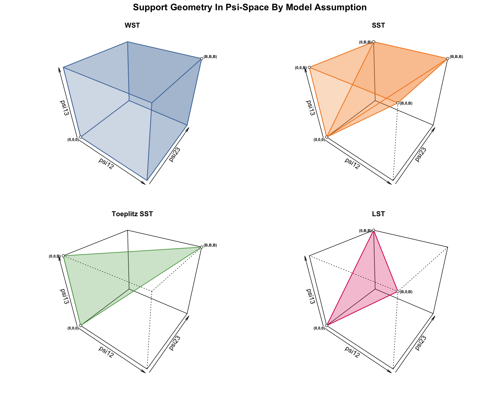
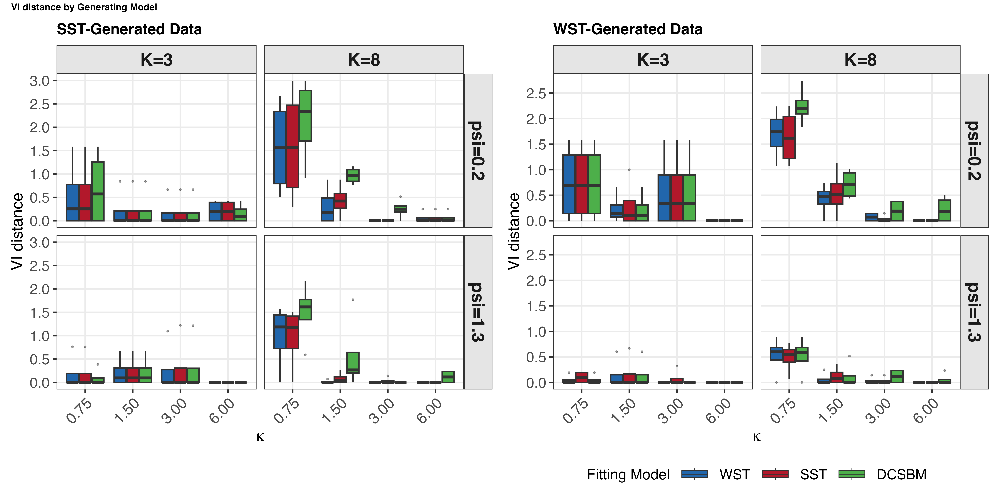
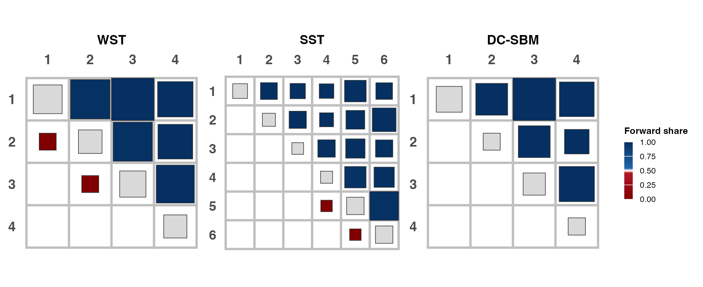
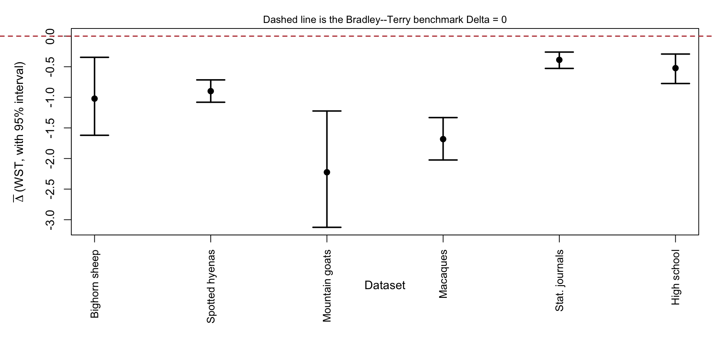

# Transitive SBM

Standalone reproduction bundle for the manuscript *Ordering Stochastic Block Models via prior transitivity*.

This is the cleaned paper-facing reproduction bundle for the ordered SBM project. Only the samplers, helper code, public scripts, six application datasets, and README preview assets needed for the paper-facing workflow remain.

The repository now contains only:

- the samplers and helper code needed for the paper-facing workflow
- the six application datasets used in the paper
- the public scripts needed to regenerate simulations, application fits, tables, and figures
- a small preview set for this README

No cached raw runs are bundled. The only committed rendered assets are the four preview images in `docs/previews/`. All real results are regenerated locally under `output/`, which is ignored by Git.

## At a glance

| Result in the PDF | Paper section | Preview / description | Generated file(s) | Script entry point(s) | Key builder function(s) |
| --- | --- | --- | --- | --- | --- |
| Figure 2 | Main text: support geometry |  | `output/diagnostics/support_geometry/support_3d_shaded_geometry.png` | [`scripts/07_plot_support_geometry.R`](scripts/07_plot_support_geometry.R) | [`save_static_3d_shaded_geometry()`](scripts/07_plot_support_geometry.R) |
| Table 1 | Main text: simulation study | Sparse weak and dense strong scenarios with `K_hat`, exact-`K` recovery, and `ARI`. | `output/simulation/tables/tab_sim_partition_main.tex` | [`scripts/02_run_main_simulation_study.R`](scripts/02_run_main_simulation_study.R)<br>[`scripts/06_build_simulation_tables_and_figures.R`](scripts/06_build_simulation_tables_and_figures.R) | [`build_main_simulation_partition_table()`](scripts/analysis/build_simulation_crossfit_tables.R) |
| Table 2 | Main text: simulation study | Compact predictive comparison for the same scenarios as Table 1. | `output/simulation/tables/tab_sim_elpd_main.tex` | [`scripts/02_run_main_simulation_study.R`](scripts/02_run_main_simulation_study.R)<br>[`scripts/06_build_simulation_tables_and_figures.R`](scripts/06_build_simulation_tables_and_figures.R) | [`build_main_simulation_elpd_table()`](scripts/analysis/build_simulation_crossfit_tables.R) |
| Figure 4 | Main text: simulation study |  | `output/simulation/plots/vi_boxplot_WST_gen.{pdf,png}`<br>`output/simulation/plots/vi_boxplot_SST_gen.{pdf,png}` | [`scripts/06_build_simulation_tables_and_figures.R`](scripts/06_build_simulation_tables_and_figures.R) | [`plot_metric_grid_hierch()`](scripts/analysis/sim_visualization.R) |
| Table 3 | Main text: application datasets | The six bundled directed weighted networks used in the application study. | `data/moreno_sheep/edges.csv`<br>`data/Strauss_2019b/edges.csv`<br>`data/mountain_goats/adjacency_matrix.csv`<br>`data/citations_data/adjacency_matrix.csv`<br>`data/macaques_data/edge_list.tsv`<br>`data/high_school/edges.csv` | Bundled data; no build step | [`paper_application_data_paths()`](helper_folder/io/application_data_loader.R)<br>[`load_application_adjacency()`](helper_folder/io/application_data_loader.R) |
| Table 4 | Main text: application study | Winners by dataset across WST, SST, and DC-SBM. | `output/paper/tables/<run_id>/model_selection_paper.tex` | [`scripts/01_run_application_mcmc.R`](scripts/01_run_application_mcmc.R)<br>[`scripts/03_build_application_postprocessing_cube.R`](scripts/03_build_application_postprocessing_cube.R)<br>[`scripts/04_build_paper_tables.R`](scripts/04_build_paper_tables.R) | [`write_model_selection_paper_outputs()`](scripts/analysis/build_paper_loo_table.R) |
| Figure 5 | Main text: application study |  | `output/paper/figures/<run_id>/moreno_sheep_SST_network_tier_line.png`<br>`output/paper/figures/<run_id>/moreno_sheep_DCSBM_network_tier_line.png` | [`scripts/01_run_application_mcmc.R`](scripts/01_run_application_mcmc.R)<br>[`scripts/03_build_application_postprocessing_cube.R`](scripts/03_build_application_postprocessing_cube.R)<br>[`scripts/05_plot_paper_application_figures.R`](scripts/05_plot_paper_application_figures.R) | [`plot_ordered_network_stress()`](scripts/analysis/osbm_visualization.R)<br>[`plot_simple_network_layout()`](scripts/analysis/regen_paper_network_figs.R) |
| Figure 6 | Main text: application study | Spotted-hyena empirical forward-share structure. | `output/paper/figures/<run_id>/strauss_2019b_combined_block_networks_clean.{pdf,png}` | [`scripts/01_run_application_mcmc.R`](scripts/01_run_application_mcmc.R)<br>[`scripts/03_build_application_postprocessing_cube.R`](scripts/03_build_application_postprocessing_cube.R)<br>[`scripts/05_plot_paper_application_figures.R`](scripts/05_plot_paper_application_figures.R) | [`plot_combined_block_networks_clean()`](scripts/analysis/osbm_visualization.R) |
| Figure 7 | Main text: application study | High-school empirical forward-share structure. | `output/paper/figures/<run_id>/high_school_combined_block_networks_clean.{pdf,png}` | [`scripts/01_run_application_mcmc.R`](scripts/01_run_application_mcmc.R)<br>[`scripts/03_build_application_postprocessing_cube.R`](scripts/03_build_application_postprocessing_cube.R)<br>[`scripts/05_plot_paper_application_figures.R`](scripts/05_plot_paper_application_figures.R) | [`plot_combined_block_networks_clean()`](scripts/analysis/osbm_visualization.R) |
| Table 9 | Supplement: application diagnostics | Cycle-diagnostic summary across the application datasets. | `output/paper/tables/<run_id>/application_cycle_diagnostics.tex` | [`scripts/01_run_application_mcmc.R`](scripts/01_run_application_mcmc.R)<br>[`scripts/04_build_paper_tables.R`](scripts/04_build_paper_tables.R) | [`build_cycle_table()`](scripts/analysis/build_application_supplement_tables.R) |
| Bradley-Terry delta plot | Application WST additivity diagnostic |  | `output/paper/figures/<run_id>/bt_delta_wst_applications.{pdf,png}` | [`scripts/01_run_application_mcmc.R`](scripts/01_run_application_mcmc.R)<br>[`scripts/09_build_bradley_terry_delta_plot.R`](scripts/09_build_bradley_terry_delta_plot.R) | [`compute_delta_summary()`](scripts/analysis/build_bt_delta_summary.R)<br>[`make_plot()`](scripts/analysis/build_bt_delta_summary.R) |

The script links above point to the public entry points. The function links point to the file that contains the named builder or plotting function used for that artifact.

## Repository Layout

```text
core/
  transitive_sbm_sampler.R
  DCSBM_varK.R
  ppc_checks.R

helper_folder/
  load_sampler_helpers.R
  config/
  diagnostics/
  io/
  models/
  simulation/

data/
  mountain_goats/adjacency_matrix.csv
  citations_data/adjacency_matrix.csv
  macaques_data/edge_list.tsv
  high_school/edges.csv
  moreno_sheep/edges.csv
  Strauss_2019b/edges.csv

scripts/
  01_run_application_mcmc.R
  02_run_main_simulation_study.R
  03_build_application_postprocessing_cube.R
  04_build_paper_tables.R
  05_plot_paper_application_figures.R
  06_build_simulation_tables_and_figures.R
  07_plot_support_geometry.R
  09_build_bradley_terry_delta_plot.R
```

## Installation

Install the required R packages:

```sh
Rscript scripts/install_required_packages.R
```

## Quick Validation

Run the two lightweight checks first:

```sh
Rscript scripts/testing/test_hierarchy_metrics.R
Rscript scripts/testing/quick_smoke_test.R
```

Then use the fast smoke paths to confirm that the cleaned repository runs from a blank `output/` tree:

```sh
DEMOKVAR_SMOKE=1 Rscript scripts/02_run_main_simulation_study.R
Rscript scripts/06_build_simulation_tables_and_figures.R
env APP_DATASETS=moreno_sheep APP_N_ITER=800 APP_BURN=200 APP_THIN=2 APP_SEED=1 Rscript scripts/01_run_application_mcmc.R
Rscript scripts/03_build_application_postprocessing_cube.R
Rscript scripts/04_build_paper_tables.R
Rscript scripts/05_plot_paper_application_figures.R
Rscript scripts/07_plot_support_geometry.R
Rscript scripts/09_build_bradley_terry_delta_plot.R
```

The `moreno_sheep` application smoke run is only a validation shortcut. For the full paper-facing application rebuild, run `scripts/01_run_application_mcmc.R` with its default six-dataset configuration.

## Public Workflow

### 1. Application Study

Run the application fits:

```sh
Rscript scripts/01_run_application_mcmc.R
```

This creates a new directory:

```text
output/application/raw/application_run_<timestamp>/
```

The post-processing and paper builders automatically use the latest application run when `APP_RUN_DIR` is not set. You can still force a specific run with `APP_RUN_DIR=...`.

To run a smaller subset during validation or debugging, pass `APP_DATASETS=<comma-separated names>`.

Build the canonical post-processing cube:

```sh
Rscript scripts/03_build_application_postprocessing_cube.R
```

Build the paper tables:

```sh
Rscript scripts/04_build_paper_tables.R
```

Build the paper figures:

```sh
Rscript scripts/05_plot_paper_application_figures.R
```

Rebuild only the Bradley-Terry delta summary:

```sh
Rscript scripts/09_build_bradley_terry_delta_plot.R
```

### 2. Simulation Study

Run the simulation grid:

```sh
Rscript scripts/02_run_main_simulation_study.R
```

Notes:

- the default reproduction setting now uses `3` replicates
- override with `DEMOKVAR_N_REP=<n>` if you want a different replicate count
- `DEMOKVAR_SMOKE=1` runs the tiny smoke grid

This creates a new directory:

```text
output/simulation/raw/DemoKvar_runs/DemoKvar_run_<timestamp>/
```

Build the simulation tables and figures from the latest simulation run:

```sh
Rscript scripts/06_build_simulation_tables_and_figures.R
```

Or target a specific results CSV:

```sh
SIM_RESULTS_PATH=output/simulation/raw/DemoKvar_runs/<run_id>/full_simulation_crossfit_final_<run_id>.csv \
Rscript scripts/06_build_simulation_tables_and_figures.R
```

### 3. Support Geometry Figure

```sh
Rscript scripts/07_plot_support_geometry.R
```

## Outputs

Generated files are written under `output/`:

- `output/application/raw/`
- `output/posterior_post_processing/`
- `output/paper/tables/`
- `output/paper/figures/`
- `output/simulation/raw/`
- `output/simulation/tables/`
- `output/simulation/plots/`
- `output/diagnostics/support_geometry/`

These outputs are not committed. A fresh clone of the repository should have an effectively empty `output/` directory except for `.gitkeep`.

## Verified Commands

The following commands were rerun successfully after the cleanup:

```sh
Rscript scripts/testing/test_hierarchy_metrics.R
Rscript scripts/testing/quick_smoke_test.R
DEMOKVAR_SMOKE=1 Rscript scripts/02_run_main_simulation_study.R
Rscript scripts/06_build_simulation_tables_and_figures.R
env APP_DATASETS=moreno_sheep APP_N_ITER=800 APP_BURN=200 APP_THIN=2 APP_SEED=1 Rscript scripts/01_run_application_mcmc.R
Rscript scripts/03_build_application_postprocessing_cube.R
Rscript scripts/04_build_paper_tables.R
Rscript scripts/05_plot_paper_application_figures.R
Rscript scripts/07_plot_support_geometry.R
Rscript scripts/09_build_bradley_terry_delta_plot.R
```

The public entry-point scripts resolve the repository root from their own path, so they can be launched either from the repository root or via an absolute script path from another working directory.
